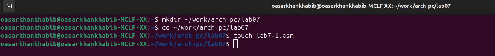
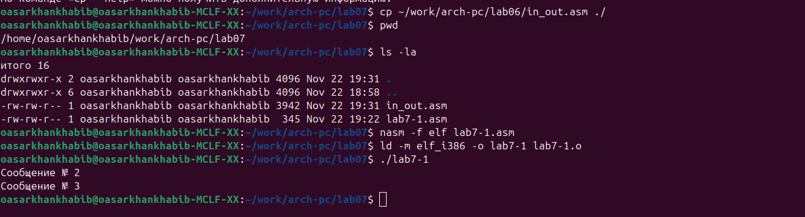
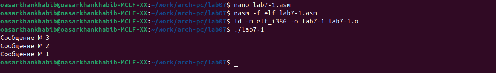
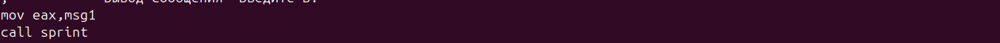
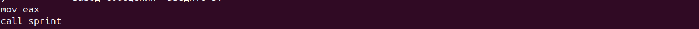
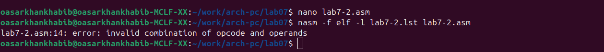
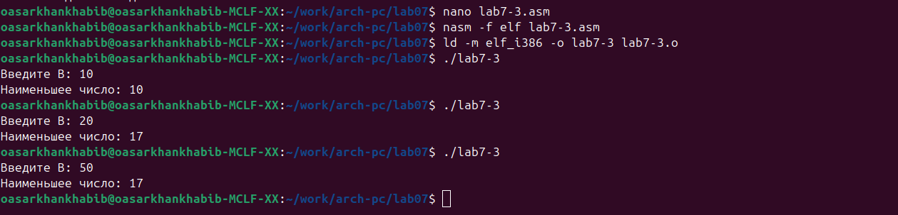
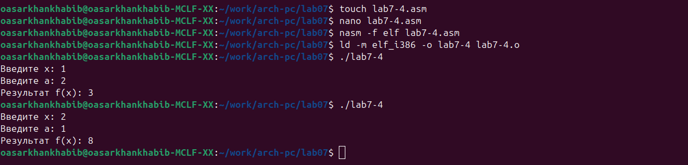

mainfont: DejaVu Serif
sansfont: DejaVu Sans
monofont: DejaVu Sans Mono
lang: ru
---
title: "лабораторная работа №7"
author: "Сархан хабиба осама"
date: "22 ноября 2025"
---

# Цель работы

Освоение арифметических инструкций языка ассемблера NASM. Изучение команд условного и безусловного переходов. 
Приобретение навыков написания программ с использованием переходов. Знакомство с назначением и структурой файла листинга.

# Ход работы

## 1. Создание каталога для лабораторной работы

```bash
mkdir ~/work/arch-pc/lab07
cd ~/work/arch-pc/lab07
touch lab7-1.asm
```


2. Создание и выполнение программы lab7-1.asm
Создан файл lab7-1.asm с программой безусловных переходов:

```
%include 'in_out.asm'

SECTION .data
msg1: DB 'Сообщение № 1',0
msg2: DB 'Сообщение № 2',0
msg3: DB 'Сообщение № 3',0

SECTION .text
GLOBAL _start
_start:
    jmp _label2
_label1:
    mov eax, msg1
    call sprintLF
    jmp _end
_label2:
    mov eax, msg2
    call sprintLF
    jmp _label1
_label3:
    mov eax, msg3
    call sprintLF
_end:
    call quit
```

Компиляция и выполнение:
```bash

nasm -f elf lab7-1.asm
ld -m elf_i386 -o lab7-1 lab7-1.o
./lab7-1
```

Результат:
Сообщение № 2
Сообщение № 3
;......................

2_2.  Изменение программы для вывода: Сообщение № 3, Сообщение № 2, Сообщение № 1

```
_start:
    jmp _label3
_label1:
    mov eax, msg1
    call sprintLF
    jmp _end
_label2:
    mov eax, msg2
    call sprintLF
    jmp _label1
_label3:
    mov eax, msg3
    call sprintLF
    jmp _label2
_end:
    call quit
```
Результат выполнения:

Сообщение № 3
Сообщение № 2
Сообщение № 1


;....................................................
3. Создание и выполнение программы lab7-2.asm
Код программы:

```
%include 'in_out.asm'

section .data
msg1 db 'Введите B: ',0h
msg2 db "Наибольшее число: ",0h
A dd 20
C dd 50

section .bss
max resb 10
B resb 10

section .text
global _start
_start:
    mov eax, msg1
    call sprint
    mov ecx, B
    mov edx, 10
    call sread
    mov eax, B
    call atoi
    mov [B], eax
    mov ecx, [A]
    mov [max], ecx
    cmp ecx, [C]
    jg check_B
    mov ecx, [C]
    mov [max], ecx
check_B:
    mov eax, max
    call atoi
    mov [max], eax
    mov ecx, [max]
    cmp ecx, [B]
    jg fin
    mov ecx, [B]
    mov [max], ecx
fin:
    mov eax, msg2
    call sprint
    mov eax, [max]
    call iprintLF
    call quit
```
Тестирование программы:

* При B=30 → Результат: 50
* При B=60 → Результат: 60
* При B=10 → Результат: 50


;..........................................

4. Работа с файлом листинга
Создание файла листинга:

```bash
nasm -f elf -l lab7-2.lst lab7-2.asm
```


Анализ трех строк листинга:
Строка 8:


8 00000000 B800000000 mov eax, msg1

    Адрес: 00000000

    Машинный код: B800000000

    Инструкция: загрузка адреса msg1 в регистр eax

Строка 9:
text

9 00000005 E8[00000000] call sprint

    Адрес: 00000005
   Машинный код: E8[00000000]

    Инструкция: вызов подпрограммы sprint

Строка 10:
text

10 0000000A B900000000 mov ecx, B

    Адрес: 0000000A

    Машинный код: B900000000

    Инструкция: загрузка адреса B в регистр ecx

7. Анализ дополнительных строк листинга
Строка 8: cmp byte [eax], 0

    Адрес в памяти: определяется во время выполнения

    Машинный код: зависит от адреса

    Инструкция: сравнение байта по адресу в eax с нулем

    Назначение: проверка достижения конца строки (нулевой байт)

Строка 9: jz finished

    Адрес в памяти: следующий за cmp

    Машинный код: 74 [смещение]

    Инструкция: переход если равно нулю (Zero Flag = 1)

    Назначение: если текущий символ = 0, переход на метку finished
Строка 10: inc eax

    Адрес в памяти: следующий за jz

    Машинный код: 40

    Инструкция: увеличение значения в eax на 1

    Назначение: переход к следующему байту в строке

Строка 11: jmp nextchar

    Адрес в памяти: следующий за inc

    Машинный код: EB [смещение]

    Инструкция: безусловный переход

    Назначение: возврат к началу цикла для проверки следующего символа

Изменения в коде:
```
; Было (правильно):
mov eax, msg1

; Стало (ошибка):
mov eax     ; Удален второй операнд msg1
```
Попытка компиляции с ошибкой:
```
nasm -f elf -l lab7-2-error.lst lab7-2.asm
```
Результат компиляции с ошибкой:
```
lab7-2.asm:15: error: parser: instruction expected
```






Анализ результатов при ошибке:

Какие файлы создаются:

     lab7-2.o - не создается

     lab7-2-error.lst - не создается

     Только сообщения об ошибках на экране

Что добавляется в листинг:

    При наличии ошибок файл листинга не создается вообще

    Транслятор выводит ошибки только на экран
;..........................................................................................

4. Создание и выполнение программы lab7-3.asm

Код программы:


```
%include 'in_out.asm'

section .data
msg1 db 'Введите B: ',0h
msg2 db "Наименьшее число: ",0h
A dd 17
C dd 23

section .bss
min resb 10
B resb 10

section .text
global _start
_start:
    mov eax, msg1
    call sprint
    mov ecx, B
    mov edx, 10
    call sread
    mov eax, B
    call atoi
    mov [B], eax
    mov ecx, [A]
    mov [min], ecx
    cmp ecx, [C]
    jl check_B
    mov ecx, [C]
    mov [min], ecx
check_B:
    mov eax, min
    call atoi
    mov [min], eax
    mov ecx, [min]
    cmp ecx, [B]
    jl fin
    mov ecx, [B]
    mov [min], ecx
fin:
    mov eax, msg2
    call sprint
    mov eax, [min]
    call iprintLF
    call quit
```
Тестирование программы:

* При B=30 → Результат: 50
* При B=60 → Результат: 60
* При B=10 → Результат: 50


;....................................................
   
5. Создание и выполнение программы lab7-4.asm

Код программы:

```
%include 'in_out.asm'

section .data
msg_x db 'Введите x: ',0h
msg_a db 'Введите a: ',0h
msg_result db "Результат f(x): ",0h

section .bss
x resb 10
a resb 10
result resb 4

section .text
global _start
_start:
    mov eax, msg_x
    call sprint
    mov ecx, x
    mov edx, 10
    call sread
    mov esi, x
    call remove_newline
    mov eax, x
    call atoi
    mov [x], eax
    mov eax, msg_a
    call sprint
    mov ecx, a
    mov edx, 10
    call sread
    mov esi, a
    call remove_newline
    mov eax, a
    call atoi
    mov [a], eax
    mov eax, [x]
    mov ebx, [a]
    cmp eax, ebx
    jl less_than
    jmp greater_equal
less_than:
    mov eax, [a]
    mov ebx, 2
    mul ebx
    sub eax, [x]
    jmp print_result
greater_equal:
    mov eax, 8
print_result:
    mov [result], ea
    mov eax, msg_result
    call sprint
    mov eax, [result]
    call iprintLF
    call quit
remove_newline:
    mov edi, esi
.next_char:
    mov al, [edi]
    inc edi
    cmp al, 0
    je .done
    cmp al, 10
    jne .next_char
    dec edi
    mov byte [edi], 0
.done:
    ret
```
Тестирование программы:

* При x=1, a=2 → Результат: 3
* При x=2, a=1 → Результат: 8




Функция:

f(x) = { 2a - x, если x < a
       { 8,     если x ≥ a
Тестирование с значениями из таблицы:

    При x=1, a=2 → Результат: 3 (2*2 - 1 = 3)

    При x=2, a=1 → Результат: 8 (x ≥ a)

Логика программы:

    Ввод значений x и a

    Сравнение x и a

    Если x < a: вычисление 2a - x

    Если x ≥ a: результат = 8

    Вывод результата


Выводы

В ходе лабораторной работы были освоены:
Команды безусловного перехода (jmp) Команды условного перехода (jg, jl, je, jz) Работа с файлами листинга NASM Написание программ с ветвлениями Преобразование данных между символьным и 
числовым форматами Анализ машинного кода и адресации в листинге Работа с языком ассемблера NASM позволяет лучше понять архитектуру компьютера и принципы работы процессора на низком уровне. 
Особенно важным было изучение циклов обработки строк и работы с флагами процессора.
